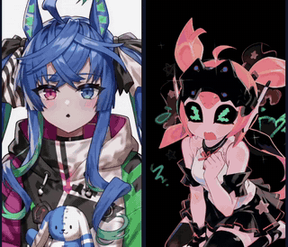
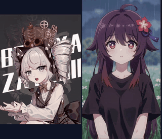
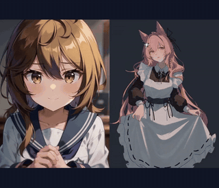
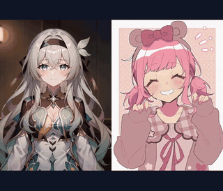
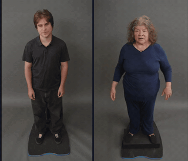
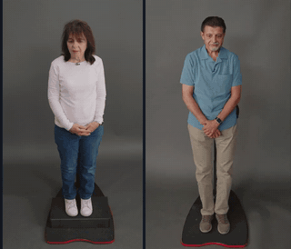
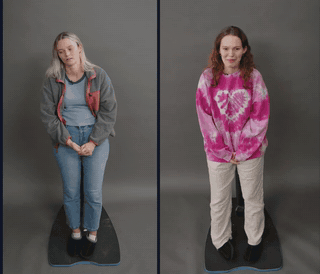

# HERM: Hierarchical Event-Routed Memory for Context-Conditioned Interactive Avatar Generation

Wenxin Fu, Zhengkun Tian, Ye Bai, Zhao You, Shidong Shang, Yingming Gao, Ya Li

> HERM equips streaming interactive avatar generation with bounded event memory. It retrieves interaction trajectories that matter under the current audio, speaking/listening state, and motion context, while controlling how generated content is written into long-term memory.

## Demo Gallery

Each animated preview shows a paired interaction result. The left side is the interaction partner; the right side is the generated avatar response. Click a preview to play its full video. For multi-model comparisons, see the [project page](https://wx-fu.github.io/HERM/).

<table>
  <tr>
    <td width="33.33%"></td>
    <td width="33.33%"></td>
    <td width="33.33%"></td>
  </tr>
  <tr>
    <td width="33.33%"></td>
    <td width="33.33%"></td>
    <td width="33.33%"></td>
  </tr>
  <tr>
    <td width="33.33%"></td>
    <td width="33.33%"></td>
    <td width="33.33%"></td>
  </tr>
</table>

Full MP4 files are also available in [the demo folder](docs/assets/readme-demos/).

## Paper

The paper is available [here](docs/assets/HERM.pdf).
